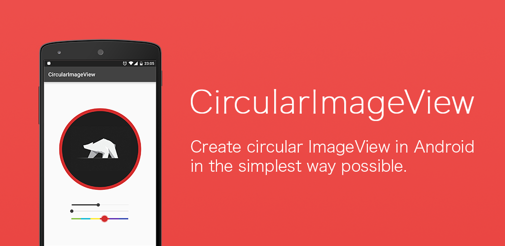
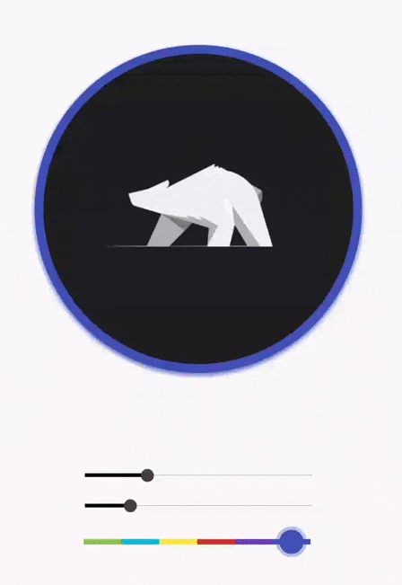
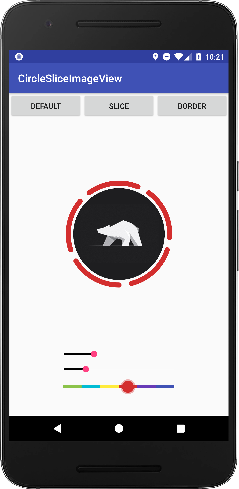

# CircleSliceImageView

<p align="center"></p>

=================



[](https://opensource.org/licenses/Apache-2.0)
[](http://developer.android.com/index.html)
[](https://jitpack.io/#hantrungkien/CircleSliceImageView)

This is an Android project allowing to realize a circular and slice ImageView in the simplest way possible.

Slice ImageView like What's App avatar

This library was developed and extended based on https://github.com/lopspower/CircularImageView and rewrited by Kotlin

USAGE
-----

To make a circular and slice ImageView add CircleSliceImageView in your layout XML and add CircularImageView library in your project or you can also grab it via Gradle:

```
allprojects {
	repositories {
		...
		maven { url 'https://jitpack.io' }
	}
}
  
dependencies {
	implementation 'com.github.hantrungkien:CircleSliceImageView:v1.0.0'
}

```



XML
-----

```xml
 <com.kienht.csiv.CircleSliceImageView
            android:id="@+id/circleSliceImageView"
            android:layout_width="200dp"
            android:layout_height="200dp"
            android:src="@drawable/logo" />
```

You must use the following properties in your XML to change your CircularImageView.


##### Properties:

* `app:civ_mode`        	  (integer)     			-> default = 0, slice = 1, border = 2
* `app:civ_border_color`          (color)     				-> default WHITE
* `app:civ_border_width`          (dimension) 				-> default 4dp
* `app:civ_background_color`      (color) 				-> default WHITE
* `app:civ_shadow`                (boolean)  	 			-> default false
* `app:civ_shadow_color`          (color)    	 		      	-> default BLACK
* `app:civ_shadow_radius`         (float)    			      	-> default 8.0f
* `app:civ_shadow_gravity`        (center, top, bottom, start or end) 	-> default bottom
* `app:civ_slice_sections`        (integer)     			-> default 2
* `app:civ_slice_border_width`    (dimension) 				-> default 4dp
* `app:civ_slice_start_angle`     (integer) 				-> default 0
* `app:civ_slice_border_color`    (color)   				-> default BLACK
* `app:civ_slice_random_color`    (boolean)     			-> default false
* `app:civ_slice_space_with_image`(boolean)     			-> default false

KOTLIN
-----

```java
val circleSliceImageView = findViewById<CircleSliceImageView>(R.id.circleSliceImageView)
circleSliceImageView.mode = CircleSliceImageView.CircularImageMode.DEFAULT_MODE.getValue()

//Set slice
circleSliceImageView.mode = CircleSliceImageView.CircularImageMode.SLICE_MODE.getValue()
circleSliceImageView.sliceSections = 3
circleSliceImageView.setSliceBorderColor(resources.getColor(R.color.GrayLight))
circleSliceImageView.sliceBorderWidth = 10f
circleSliceImageView.sliceStartAngle = 90
circleSliceImageView.setBackgroundColor(Color.RED)
circleSliceImageView.isSliceRandomColor = true
circleSliceImageView.isSpaceSliceWithImage  = true

//Set border
circleSliceImageView.mode = CircleSliceImageView.CircularImageMode.BORDER_MODE.getValue()
circleSliceImageView.setBorderColor(resources.getColor(R.color.GrayLight))
circleSliceImageView.borderWidth = 10f
circleSliceImageView.isShadowEnable = true
circleSliceImageView.addShadow()
circleSliceImageView.shadowRadius = 15f
circleSliceImageView.shadowColor = Color.RED
circleSliceImageView.setBackgroundColor(Color.RED)
circleSliceImageView.shadowGravity = CircleSliceImageView.ShadowGravity.CENTER

```

JAVA
-----

```java
CircleSliceImageView circleSliceImageView = (CircleSliceImageView)findViewById(R.id.yourCircularImageView);
circleSliceImageView.setMode(CircleSliceImageView.CircularImageMode.DEFAULT_MODE)

//Set slice
circleSliceImageView.setMode(CircleSliceImageView.CircularImageMode.SLICE_MODE)
circleSliceImageView.setSliceSections(3);
circleSliceImageView.setSliceBorderColor(getResources().getColor(R.color.GrayLight));
circleSliceImageView.setSliceBorderWidth(10);
circleSliceImageView.setSliceStartAngle(90);
circleSliceImageView.setBackgroundColor(Color.RED);
circleSliceImageView.setSliceRandomColor(true);
circleSliceImageView.setSpaceSliceRandomColor(true);
circleSliceImageView.setSpaceSliceWithImage(true);

//Set border
circleSliceImageView.setMode(CircleSliceImageView.CircularImageMode.BORDER_MODE)
circleSliceImageView.setBorderColor(getResources().getColor(R.color.GrayLight));
circleSliceImageView.setBorderWidth(10);
circleSliceImageView.setShadowEnable(true)
circleSliceImageView.addShadow();
circleSliceImageView.setShadowRadius(15);
circleSliceImageView.setShadowColor(Color.RED);
circleSliceImageView.setBackgroundColor(Color.RED);
circleSliceImageView.setShadowGravity(CircularImageView.ShadowGravity.CENTER);

```

LIMITATIONS
-----

* By default the ScaleType is CENTER_CROP. You can also used CENTER_INSIDE but the others one are not supported.
* Enabling adjustViewBounds is not supported as this requires an unsupported ScaleType.

LINK
-----

A special thanks go to [Mr. Igalata](https://github.com/lopspower)

LICENCE
-----

    Copyright 2018 Kien Han Trung

    Licensed under the Apache License, Version 2.0 (the "License");
    you may not use this file except in compliance with the License.
    You may obtain a copy of the License at

       http://www.apache.org/licenses/LICENSE-2.0

    Unless required by applicable law or agreed to in writing, software
    distributed under the License is distributed on an "AS IS" BASIS,
    WITHOUT WARRANTIES OR CONDITIONS OF ANY KIND, either express or implied.
    See the License for the specific language governing permissions and
    limitations under the License.


